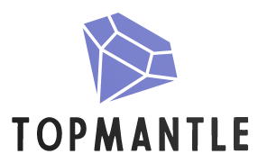

# **topMantleNFT**
## a decentralized NFT marketplace built on Mantle



**topMantleNFT** is an automated market maker protocol that facilitates **NFT-to-token swaps** (and vice versa) using bonding curves. 

Liquidity providers (LPs) can deposit assets into single-sided buy or sell pools, or into dual-sided trade pools which buy and sell NFTs.

topMantleNFT makes no distinction between different ERC721 IDs. Pools that are willing to buy or sell NFTs will return the same price no matter which NFT is sent in or out from the collection.

## **How does it work?**

1. Liquidity providers **deposit** NFTs and/or an ERC20 token into liquidity pools. They choose whether they would like to buy or sell NFTs, specify a starting price and **bonding curve**.

2. Users can then buy NFTs from or sell NFTs into these pools. Every time an item is bought or sold, the price to buy or sell another item changes for the pool based on its bonding curve.
3. At any time, liquidity providers can change the parameters of their pool or withdraw assets.

Pools use a bonding curve (a mathematical formula which defines the relationship between an asset's price and its supply) to determine the relative price at which one asset is traded for another. Let $p$ be the price and $s$ be the supply, then some examples of bonding curves are:

- **Linear**:

$$
p = \delta s
$$

- **Exponential**:

$$
p = \delta s^{-k}
$$

- **Constant-product (asymptotical)**:

$$
p = \frac{\delta}{s}
$$

($\delta$ and $k$ are curve parameters whose explanation is beyond the scope of this document).

### **NFT Collections**

In addition, to showcase **topMantle**, we have deployed 3 collections of NFTs on the Mantle Blockchain, whose images were created through a generative artificial intelligence called [**DALL-E**](https://openai.com/product/dall-e-2):

#### **Queens of Damnation**
Contract address: [`0x9BDCf71048DFd8ef1C03a7ae3EDe79F04A096B7F`](https://explorer.testnet.mantle.xyz/address/0x9BDCf71048DFd8ef1C03a7ae3EDe79F04A096B7F)


#### **Capybara birthday**
Contract address: [`0x4E457c172144D4a1f08F61F54A37dd819a6ba28E`](https://explorer.testnet.mantle.xyz/address/0x4E457c172144D4a1f08F61F54A37dd819a6ba28E)


#### **Faces of truth**
Contract address: [`0xfbC71A6Ba7DdF32bD2C53ec0A9bd5df4e0d828Ac`](https://explorer.testnet.mantle.xyz/address/0xfbC71A6Ba7DdF32bD2C53ec0A9bd5df4e0d828Ac)


### **ERC20 tokens**

We also deployed an ERC20 token called `MantleMonke` (contract address: [`0xaDe2910F16c1f2cFe963d84d248d85748288D6Ca`](https://explorer.testnet.mantle.xyz/address/0xaDe2910F16c1f2cFe963d84d248d85748288D6Ca)).

Since we needed a stable coin to reference our market, we created the `BITUSD` ERC20 token (contract address: [`0x00C6222A800Df9a4D8358Bbd65D3D7B142AA4B8B`](https://explorer.testnet.mantle.xyz/address/0x00C6222A800Df9a4D8358Bbd65D3D7B142AA4B8B)), whose emission is dictated by the BIT/USD pair price retrieved from the `Goerli` testnet by means of the [Pyth offchain pricefeed oracle](https://pyth.network/price-feeds/crypto-bit-usd?cluster=testnet). Our offchain server feeds this information into our `MasterOracle` contract (contract address: [`0x64a7B710578A1c68C3B63D836ADDfb9939c80b83`](https://explorer.testnet.mantle.xyz/address/0x64a7B710578A1c68C3B63D836ADDfb9939c80b83)), which `BITUSD` retrieves its price from whenever someone attempts to mint tokens.

### **Protocol Implementation**

The addresses where all the protocol parts are deployed are shown below:

```solidity
LSSVMPairEnumerableETH = 0xcfe0e4255366c8dcb862c713c4076cc79b04fab7
LSSVMPairMissingEnumerableETH = 0xd1add8906500fa133d81c5b641f66fa893c83f14
LSSVMPairEnumerableERC20 = 0x478e65c49ade0952e5838be86f1dc1c1ac275157
LSSVMPairMissingEnumerableERC20 = 0x172a56100ed404284338f5c38e874f109ff80a3d
LSSVMPairFactory = 0x2c2077d29ed1784ae559e5f5ae527fae3d9fa8c3
LSSVMRouter = 0x556589f7324fb1f3d038c6e1e2a025db99750d12
ExponentialCurve = 0xf0722cdfc7072660f8e3e27761c4d8edaa1d8105
LinearCurve = 0xf5b0f6c228c190e12936167f34ec1afd54920105
```

### **Public Goods**

We deeply believe that web3 is a powerful tool to promote fair and responsible governance action and empower those who are voiceless. For that reason, we contribute part of the protocol's earned fees towards public goods previously voted by the **topMantle** community. This is done by setting the `protocolFeeRecipient` variable within the protocol to an address controlled by a benefic cause organization. Right now, we are rooting for the [ByeByePlastic Foundation](https://www.byebyeplastic.life/), but this can change in the future.

Donate to their initiative by transferring funds to the following address: `0x1790b48CD049D5197458becc1fBeeE4bB985e589`.

Our intention is to use the fundamental building blocks available to create a **NFT-DeFi ecosystem** on top of **Mantle** while contributing towards a **better future**. 
